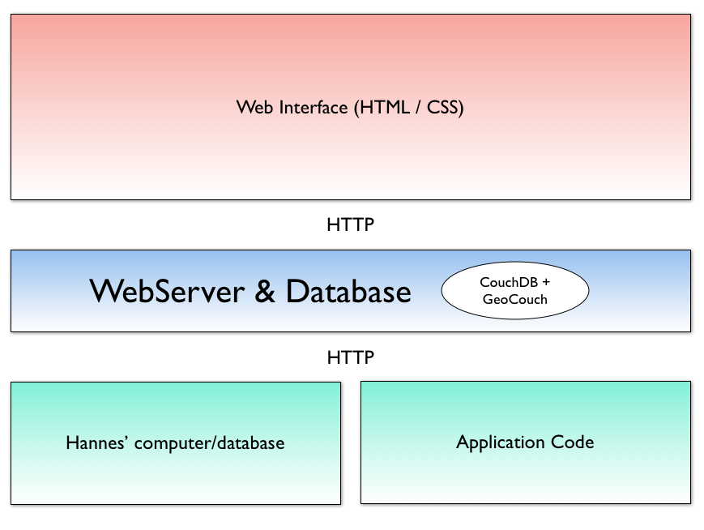

# Collecting Missions Website Work Plan

The idea is to build a website for the collecting missions data, so that users can access and query this data using a geographical interface (through a map), and also a programmatic interface (API). We're going to outline the questions that this website needs to answer, describe the technology that would be easiest to use, and then provide a work plan for each of the activities needed to build such website.

## What queries are going to be made against the data?

- **Get missions from specific locations.**  
  We'll provide a Map entry point where users can select specific areas, and show the missions which coordinates belong to that area.
      
- **Filter missions based on map layers.**  
  Users are going to be able to select certain pre-defined layers and filter the missions upon that. For example, they will be able to select the "countries layer" which will outline all the countries on the map. Then they will be able to select elements of that layer (for example Italy) and the website will filter the data based on their selection. We will apply other layers, such as evironment related layers, so that users can filter the data based on certain climatic conditions. We'll also allow users to insert their own layers.
   
- **Allow customized queries.**  
  Finally, users will have the freedom to filter based on any specific property of a mission. For example, they might need to get a mission with a specific ID, look for a specific crop, search all the samples collected by a specific collector, or within a specific date range.

## What techonology should we use?

Let's firstly analyze the current scenario:

- **The data is currently maintained using Microsoft Access.**  
  We can use existing tools to export MS Access data to other databases, which can then be used on the website.
  
- **It is usually updated by a single person and it's not updated very often. Mostly once a week.**  
  This means that the website can afford to have low levels of concurrency, so not much time should be wasted regarding performance of upload.
  
- **The data contains coordinates of missions and can be as large as 2gb.**  
  Given the type of spacial queries that are needed, we need to find a good geodatabase that was built specifically to serve large amount of spatial data.
  
### Technology

Given the queries that we need to answer and the current scenario, we can better choose the technology stack:

- **CouchDB + GeoCouch for database.**  
  CouchDB gives us the benefits of a built-in REST api that will enable people to interact with the website using a programmatic interface. GeoCouch on the other hand will take care of the spatial queries that are needed in the map interface.
  
- **HTML5, CSS3, JavaScript, jQuery for the interface.**  
  The HTML5, CSS3 and JavaScrpt are obvious open standards to choose from for building the interface. Given the simplicity of the interface - which is essentially a single page, with a  map - we can afford to use jQuery and re-use as many jQuery plugins as possible for different functionalities.

- **Google Maps, layers, overlays & KML for the map interactivity.**  
  It's still under research how easy it is to add layers and overlays to locations, and allow you to retrieve the "box" information which can then be passed to GeoCouch. This should be straightforward
  
## Schema

## Work Plan Activities

1. **Buy a domain and setup a CouchDB + GeoCouch server in collaboration with the IT unit.**     
   We should ask IT to handle hosting. Luca will talk to Dario and get an estimate of the cost.  
   
   Hannes - ?  
   Luca - 10 days  
   IT unit - ?
   
2. **Setup the tool that will convert the MS Access database that Hannes maintains, into JSON, and that will then import it into CouchDB.**    
   This is a command-line tool that will need to be installed on Hannes' computer, or any other computer that needs to upload the data to the website.
   
   Hannes - ?  
   Luca - 15 days  
   Simone or Kenny? - 10 days
   
3. **Build the interface for the website, based on the queries identified.**  
   This also includes the map layer query interface. 
   
   Luca - 20 days  
   Hannes - ?
   
4. **Develop the backend of the website. In particular the logic for making the queries.**  
   Luca - 20 days   
   Simone or Kenny? - 10 days 
   
**Luca's time**  
Luca has 50% of his time on this project. He'll start working on it on June  13th and expects to have a first prototype version online by **August 1st**. A more stable/complete version will be online by **September 1st** - please let him know if this date is ok.

**Hannes' time**  
(help in building the interface. in explaining the data-structure of the database. in building the tool that converts the database. in providing the shapefiles/kml files for the map layers. in testing the tool. etc..)

**Simone or Kenny's time**  
A possibility would be to hire Simone or Kenny (Luca knows more about Kenny's skills, which would be very good for the project). Kenny could be hired part-time. The other half he would still be working for the IT unit, so that he has knowledge about the server setup as well. For the activities, we need him for 20 days overall, but maybe we can setup a 3 month contract (part-time) or something? Whichever the budget allows us. This person will work closely with Luca, and they'll document everything on GitHub.

